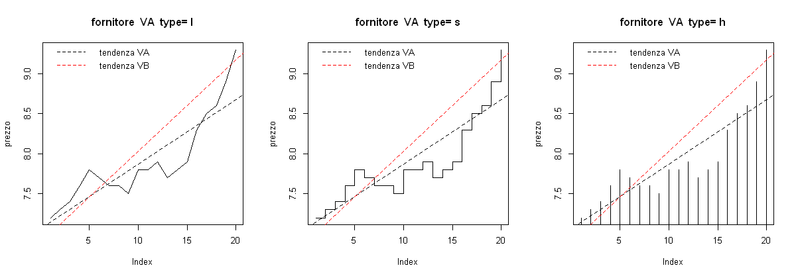
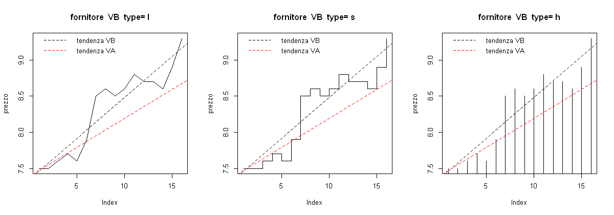
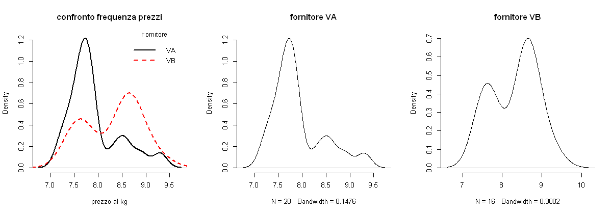
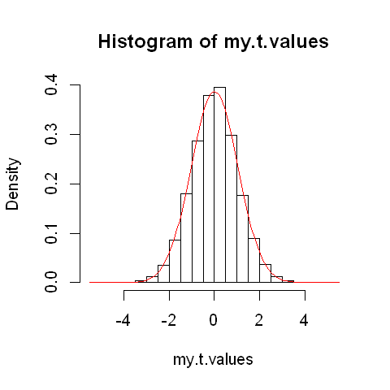

# Analisi statistica prezzi fornitori e simulazione stocastica con t-test e p-value in R

Molto spesso nella pratica di scelta o di scambio tra due fornitori siamo chiamati a prendere delle decisioni in base al prezzo di vendita della merce e altri fattori. Tali decisioni spesso vengono prese in base a semplici confronti di convenienza economica, basate sull'ultima e/o penultima quotazione ricevuta. Un attenta analisi dei dati può aiutarci a prendere le giuste decisioni e creare valore aggiunto.

In questo caso si vuole investigare, su base di dati campionari e di ampiezza ridotta (N<30), l'andamento dei prezzi di vendita della lamiera in alluminio tra due fornitori e determinare se tali variazioni di prezzo siano indipendenti dal tipo di fornitore, nonché correlati esclusivamente alle oscillazioni del valore di mercato della materia prima e che non vi è dunque una sostanziale differenza di scelta economica tra i due. Considerando che le variazioni del valore di mercato della materia prima sono le stesse per entrambi, possiamo affermare che: a parità di qualità di produzione tra i due fornitori, per dimostrare l'ipotesi di indipendenza, basterà determinare che la differenza della media dei prezzi non è statisticamente significativa. 

Utilizzeremo un test di ipotesi e di significatività per piccoli campioni (t-test). Nel test, si è deciso di utilizzare un livello di significatività dello 0,05 (cioè del 5%), che rappresenta la probabilità massima con cui accettiamo di sbagliare rifiutando l'ipotesi descritta quando invece avrebbe dovuto essere accettata. In altre parole il 5% di probabilità massima di essere in errore accettando l'eventuale ipotesi alternativa: che i prezzi di vendita sono dipendenti dal tipo di fornitore e che quindi la differenza della media delle osservazioni è significativa.

Da un analisi di due fornitori presi in esame si è prodotto il seguente file:

    vanAllC.csv
    
Il file è di tipo csv con virgola come metodo di separazione e raccoglie l'andamento dei prezzi al kg (con "." come separatore decimale e arrotondamento a una cifra) riferiti alla lamiera di alluminio grezza da 1mm di spessore. I dati sono stati raccolti durante gli ultimi due anni e non sono noti rifierimenti temporali delle osservazioni, ma è accertata l'univocità dei rilevamenti, ordinati dal più datato a quello più recente, suddivisi per fornitore e incolonnati.


## Importazione file in R e visualizzazioni

Per cominciare si importa il file in R così da poter lavorare con i dati al suo interno:


```R
my.data <- read.csv("vanAllC.csv", sep=",") # questo file csv necessita del separatore "," 
cat("quantità di osservazioni per fornitore: ", paste(unique(my.data$vendor),(summary(my.data$vendor))))
my.data[15:20,]; tail(my.data)
datarws <- nrow(my.data) # aggiungo il totale numero di osservazioni a datarws per utilizzarlo anche in seguito
cat("numero totale di osservazioni: ", datarws)
```

    quantità di osservazioni per fornitore:  VA 20 VB 16


<table>
<thead><tr><th></th><th scope=col>vendor</th><th scope=col>price.mo</th></tr></thead>
<tbody>
	<tr><th scope=row>15</th><td>VA </td><td>7.9</td></tr>
	<tr><th scope=row>16</th><td>VA </td><td>8.3</td></tr>
	<tr><th scope=row>17</th><td>VA </td><td>8.5</td></tr>
	<tr><th scope=row>18</th><td>VA </td><td>8.6</td></tr>
	<tr><th scope=row>19</th><td>VA </td><td>8.9</td></tr>
	<tr><th scope=row>20</th><td>VA </td><td>9.3</td></tr>
</tbody>
</table>


<table>
<thead><tr><th></th><th scope=col>vendor</th><th scope=col>price.mo</th></tr></thead>
<tbody>
	<tr><th scope=row>31</th><td>VB </td><td>8.8</td></tr>
	<tr><th scope=row>32</th><td>VB </td><td>8.7</td></tr>
	<tr><th scope=row>33</th><td>VB </td><td>8.7</td></tr>
	<tr><th scope=row>34</th><td>VB </td><td>8.6</td></tr>
	<tr><th scope=row>35</th><td>VB </td><td>8.9</td></tr>
	<tr><th scope=row>36</th><td>VB </td><td>9.3</td></tr>
</tbody>
</table>


    numero totale di osservazioni:  36

Possiamo notare che in due anni sono state raccolte 20 osservazioni per il fornitore VA (le prime 20 osservazioni) e 16 per il VB (le ultime 16 delle 36 in totale).

Le tre osservazioni più recenti (dal n°18 al 20 per VA e dal n°34 al 36 per VB) mostrano prezzi identici, rispetivamente:
- VA 8.6, 8.9, 9.3
- VB 8.6, 8.9, 9.3

Osservando l'andamento dell'ultimo periodo, viene da conludere che non c'è differenza sostanziale tra i prezzi proposti dai fornitori. Ma potrebbe essere casuale. 

Vogliamo quindi appurare che la differenza della media dei prezzi di tutte le osservazioni tra i due fornitori non è statisticamente significativa. Per questo utilizzeremo il t-test e  la funzione t.test() in R per ottenere un test statistico e un p-value dalla serie di dati campione di ampiezza inferiore a n°30 osservazioni, con varianza della popolazione sconosciuta e campioni non accoppiati.

Prima di cominciare, creiamo un data frame con i prezzi per ogni fornitore e calcoliamo la media per avere un idea della differenza.


```R
data1 <- my.data$price.mo[my.data$vendor==unique(my.data$vendor)[1]] 
data2 <- my.data$price.mo[my.data$vendor==unique(my.data$vendor)[2]]

# conservo in n1 e n2 il numero di osservazioni per fornitore
n1 = length(data1); n2 = length(data2)

# inserisco in v1 e v2 il nome del fornitore e calcolo in md1 e md2 la media delle osservazioni
v1 = unique(my.data$vendor)[1]; v2 = unique(my.data$vendor)[2]
md1 = mean(data1); md2 = mean(data2) 

cat("media prezzi per fornitore: \n", 
    paste(v1,"\n","€",round(md1,2),"\n", v2,"\n","€",round(md2,2))
   )
```

    media prezzi per fornitore: 
     VA 
     € 7.91 
     VB 
     € 8.31

Visualizziamo ora con dei grafici l'andamento dei prezzi per i due fornitori.


```R
library(repr) # utilizzo il package "repr" per avere più controllo sulle dimensioni dei grafici
    options(repr.plot.width=10, repr.plot.height=3.5)

par(mfrow=c(1,3)) 
opts <- c("l","s","h") # visualizziamo grafici del tipo lines, stair steps e vertical lines histogram
for(i in 1:length(opts)){
  heading = paste("fornitore ",v1," type=",opts[i])
  plot(data1, ylab="prezzo", type="n", main=heading)
  lines(data1, type=opts[i])
    # regressione lineare tra i valori e il n° delle osservazioni per traciare linee di tendenza
    abline(lm(data1~c(1:n1)), lty=2) 
    abline(lm(data2~c(1:n2+(n1-n2))), col="red", lty=2) # inserisco linea di tendenza del secondo fornitore
    legend("topleft", c(paste("tendenza",v1),paste("tendenza",v2)), cex = 1, y.intersp=3,
        col=c("black","red"), lty=2:2, bty="n")
}
for(i in 1:length(opts)){
  heading = paste("fornitore ",v2," type=",opts[i])
  plot(data2, ylab="prezzo", type="n", main=heading)
  lines(data2, type=opts[i])
    # regressione lineare tra i valori e il n° delle osservazioni per traciare linee di tendenza
    abline(lm(data2~c(1:n2)), lty=2)
    abline(lm(data1~c(1:n1-(n1-n2))), col="red", lty=2) # inserisco linea di tendenza del secondo fornitore
    legend("topleft", c(paste("tendenza",v2),paste("tendenza",v1)), cex = 1, y.intersp=3,
        col=c("black","red"), lty=2:2, bty="n")
}
```








Non è possibile confrontare direttamente l'andamento dei prezzi nel tempo o confrontarli per indice poiché non sappiamo se esistono corrispondenze tra le osservazioni dei due fornitori. Possiamo però confrontare le linee di tendenza e farci un idea del loro andamento. E possiamo notare un certo scostamento.

Verifichiamo poi con il t-test se la differenza del valore medio delle distribuzioni non è significativa.

## t-test 

Creiamo ora il t.test() a due code per ottenere il test statistico e il p-value in R. Se avessimo avuto pari osservazioni  per entrambi i fornitori (ad esempio con un accoppiamento mensile), avremmo potuto utilizzare il parametro paired=TRUE per eseguire il t-test accoppiato.


```R
testResult <- t.test(data1,data2) # il t.test con i parametri di default è sufficiente
testResult
```


    
    	Welch Two Sample t-test
    
    data:  data1 and data2
    t = -2.1256, df = 31.277, p-value = 0.04154
    alternative hypothesis: true difference in means is not equal to 0
    95 percent confidence interval:
     -0.78856339 -0.01643661
    sample estimates:
    mean of x mean of y 
       7.9100    8.3125 
    


Siamo interessati a verificare che la differenza della media dei prezzi dei due fornitori non è significativa, e abbiamo fissato il nostro livello di significatività a 0.05. Se il p-value è uguale o inferiore a quella soglia, l'ipotesi che la differenza della media dei prezzi dei due fornitori non è significativa, viene scartata. 

Nel nostro caso abbiamo un p-value = 0.04154 inferiore al valore da noi prefissato e quindi al momento l'ipotesi è che i due fornitori abbiano medie dei prezzi significativamente differenti.

Tuttavia questo p-value è valido se i dati sono normalmente distribuiti, e possiamo notare il t-value negativo nel test t = -2.12 quando invece dovrebbe essere vicino allo 0. Per visualizzare creiamo un histogram density plot dei prezzi per il fornitore VA e uno per il fornitore VB così da poterli confrontare per frequenza.


```R
par(mfrow=c(1,3))

plot(density(data1), main="confronto frequenza prezzi", xlab="prezzo al kg", bty="n", lwd=2)
lines(density(data2), col="red", lty=2, lwd=2)
legend("topright", c(paste(v1),paste(v2)), title="Fornitore", cex = 1, y.intersp=3,
   col=c("black","red"), lty=1:2, lwd=2, bty="n") 

plot(density(data1), main=paste("fornitore", v1), bty="n")
plot(density(data2), main=paste("fornitore", v2), bty="n")
```





Nessuno dei due set di dati è normalmente distribuito.

Per ricreare una situzione vicina alla distribuzione normale possiamo usare una simulazione e ottenere così un p-value corretto. 

Sapendo che se VA e VB avessero avuto una distribuzione approssimativamente uguale, avremmo potuto utilizzare indistintamente i dati dell'uno o dell'altro nella simulazione. Ispirati da questo lo scopo ora è di ricreare una simile situazione..

## Simulazione e algoritmo stocastico

Procederemo in questo modo:
- Determiniamo il numero (n1) di osservazioni per il fornitore VA. 
- Assegniamo il numero n1 di dati scelti in modo uniformemente casuale e li associamo al fornitore VA, e lasciamo il restante al VB. 
- Calcoliamo il t-test statistico per i due gruppi.


```R
cat("il numero n1 di osservazioni per il fornitore VA è: ", n1)
```

    il numero n1 di osservazioni per il fornitore VA è:  20

Come creare l'algoritmo per simulare la stessa distribuzione di prezzi tra VA e VB?
 - Si crea un nuovo data frame da my.data (del file csv), e si assegna "VB" come fornitore a tutte le osservazioni.
 - Campionare n1 numeri casuali con la funzione sample(), e metterli in index.temp.
 - Si assegna l'etichetta fornitore “VA” esattamente a quei prezzi corrispondenti alle osservazioni (n1) in index.temp.
 - Formare poi i due nuovi gruppi, e avviare il test statistico su di essi.

Con questo, abbiamo elaborato l'algoritmo stocastico della simulazione.


```R
set.seed(1234)
my.new.data <- my.data
my.new.data$vendor <- v2 # ricordo che v2 = "VB"
index.temp <- sample(1:datarws,n1)  
my.new.data$vendor[index.temp] <- v1 # ricordo che v1 = "VA"
new.data1 <- my.new.data$price.mo[my.new.data$vendor==v1]
new.data2 <- my.new.data$price.mo[my.new.data$vendor==v2]
t.test(new.data1,new.data2)$statistic
```


<strong>t:</strong> 1.61568860156747


Ora che è stata eseguita una simulazione, possiamo creare una funzione, e avviare 100000 (centomila) simulazioni in modo da ottenere una distribuzione normale dei parametri e poter poi calcolare il p-value della simulazione. 


```R
set.seed(554)

my.new.data <- my.data

doone = function(){
    my.new.data$vendor = v2
    index.temp = sample(1:datarws, n1)  
    my.new.data$vendor[index.temp] = v1
    new.data1 = my.new.data$price.mo[my.new.data$vendor==v1]
    new.data2 = my.new.data$price.mo[my.new.data$vendor==v2]
    t.val = t.test(new.data1, new.data2)$statistic
    as.numeric(t.val)
}
```

Per ottenere il p-value della distribuzione t che andremo a simulare, potrà essere calcolata come la media della somma del numero delle volte che il valore t simulato è maggiore del positivo (regione critica +) del teorico t-value calcolato nel primo t-test e il numero delle volte che è minore del suo corrispettivo negativo (regione critica -).


```R
my.t.values <- replicate(100000, doone())

lt.ut <- 0
for (i in my.t.values){
    ifelse(
        i<as.numeric(testResult[1]) | i>abs(as.numeric(testResult[1])), 
        lt.ut <- lt.ut+1, 
        lt.ut
    )
}
pvs <- (lt.ut)/100000
```


```R
cat("p-value calcolato dalla simulazione: ", pvs)
options(repr.plot.width=4, repr.plot.height=4)
hist(my.t.values, prob=T)
curve(dnorm(x, mean=mean(my.t.values), sd=sd(my.t.values)), , col="red", add=TRUE)
```

    p-value calcolato dalla simulazione:  0.04206





L'idea che i valori seguano una distribuzione uniforme ora sembra ragionevole.

## Conlcusioni

Possiamo quindi rifiutare la nostra ipotesi iniziale e dire che i prezzi di vendita per le lamiere di alluminio di spessore da 1mm per i due fornitori presi in esame, non sono indipendenti dal tipo di fornitore. 

Con un p-value di 0.04206 molto simile a quello teorico calcolato con il primo t-test, viene accettata l'ipotesi alternativa: cioè che la differenza della media dei prezzi tra i fornitori è significativa, con un intervallo di differenza che può oscillare  tra il -0.78 e -0.01 a favore del fornitore VA, va fatto notare che questo intervallo è puramente teorico e ulteriori analisi e test andrebbero condotti per accertarlo.
